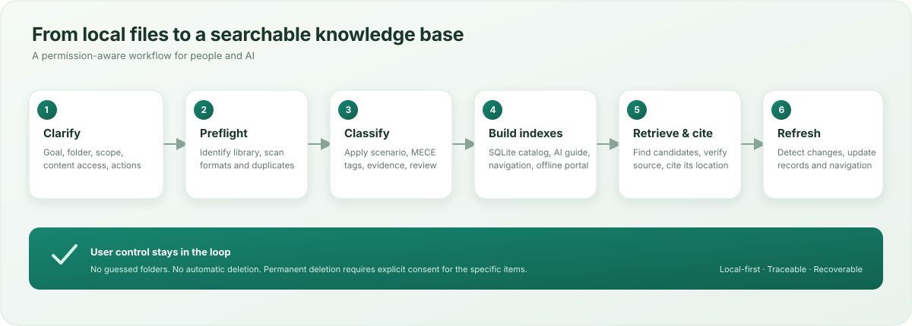

# AI Local File Knowledge Base

Create, organize, maintain, and search a personal local file knowledge base. The Skill classifies, tags, renames, and moves files when the user has clearly requested those actions; it supports incremental refresh, traceable source citations, duplicate detection, lifecycle metadata, and AI retrieval.

## Choose a package

- **English package for installation:** [github-en/](github-en/)
- **Original Chinese package:** the repository root, containing SKILL.md, agents/, assets/, references/, and scripts/.

Install only one package as a Skill. Do not copy the entire repository into a Skills directory because it contains two SKILL.md files.

## Install the English package in Codex

Requirements: Codex Skills support and Python 3.10+ for the included local scripts. The package does not require Jevbox, MCP, a cloud API, or a network connection to manage a local library.

### Windows PowerShell

From a checkout of this repository, copy the English bundle contents into a Skill folder:

~~~powershell
$skillPath = Join-Path $env:USERPROFILE ".codex/skills/folder-knowledge-base"
New-Item -ItemType Directory -Path $skillPath -Force | Out-Null
Copy-Item -Path ".\github-en\*" -Destination $skillPath -Recurse -Force
~~~

Restart or refresh Codex Skills if the new Skill does not appear. If your Codex installation uses a custom skills directory, copy the bundle there instead.

### macOS / Linux

From a checkout of this repository:

~~~sh
mkdir -p "$HOME/.codex/skills/folder-knowledge-base"
cp -R github-en/. "$HOME/.codex/skills/folder-knowledge-base/"
~~~

Use the Skills directory configured by your Codex installation if it differs from the default.

## Safe first use

Tell the Skill the exact local folder, the task (create, search, maintain, propose, or organize), what content it may read, and whether it may only write indexes or also rename/move files. The Skill asks before acting when a decision that affects scope or authorization is missing.

Permanent deletion always requires explicit consent for the specific target and action. Exact duplicates can be moved to a recoverable quarantine folder when the user explicitly requests deduplication. The Skill does not connect to another service or send content elsewhere by itself.

## What it creates

A managed library has a root AI_INDEX.md for navigation, AI_README.md with retrieval instructions, an offline human-browsing HTML snapshot, and .filedb/catalog.sqlite for structured metadata. The portal is named `file-knowledge-base.html`; its interface defaults to English and can switch to Chinese. User-provided names, tags, and source content remain in their original language. Search results should be verified against the current original file and cited with its path and, when available, page/line/section/time location.

The included scripts provide inventory, hashing, parsing where supported, duplicate comparison, incremental refresh, SQLite-backed search, planning, and recoverable file operations. Model-dependent semantic classification is performed by the agent; a watcher or script alone cannot provide it.

## Repository layout

~~~text
.
├── SKILL.md                    # Original Chinese Skill bundle
├── agents/                     # Chinese-bundle agent metadata
├── assets/
├── references/
├── scripts/
├── github-en/                  # Complete English installable Skill bundle
│   ├── SKILL.md
│   ├── agents/
│   ├── assets/
│   │   ├── ai-readme-template.md
│   │   └── library-readme-template.md
│   ├── references/
│   └── scripts/
└── docs/images/
    └── workflow-overview.svg
~~~

## Validation and known limits

The validation history in github-en/references/validation.md describes the original Chinese v0.7.0 scripts and synthetic fixtures. It is not independent behavioral acceptance of the translated English bundle or of a real user's files. The English package is intended for the Codex Skills convention; other agent platforms may require packaging changes. Parser coverage depends on the local environment. There is no built-in OCR, semantic/vector search service, or always-on background updater.

## License and public release

This repository is currently a private prerelease. No standalone reuse license has been declared for this repository. Do not redistribute or make it public until the owner confirms the rights and adds a suitable LICENSE file. GitHub explains [how repository licensing works](https://docs.github.com/en/repositories/managing-your-repositorys-settings-and-features/customizing-your-repository/licensing-a-repository).
